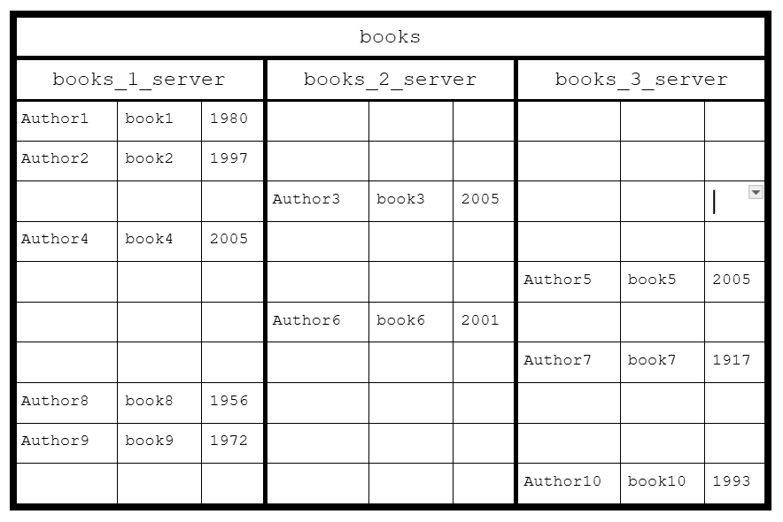
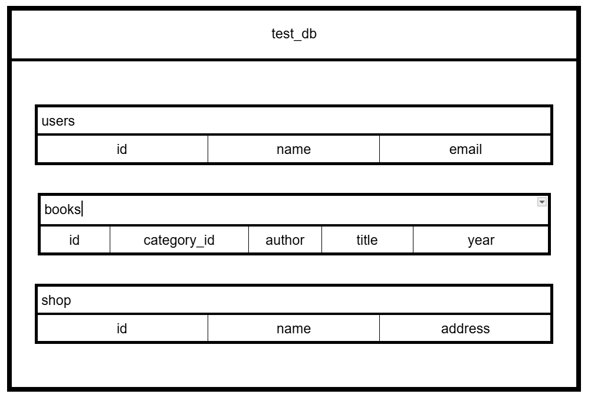
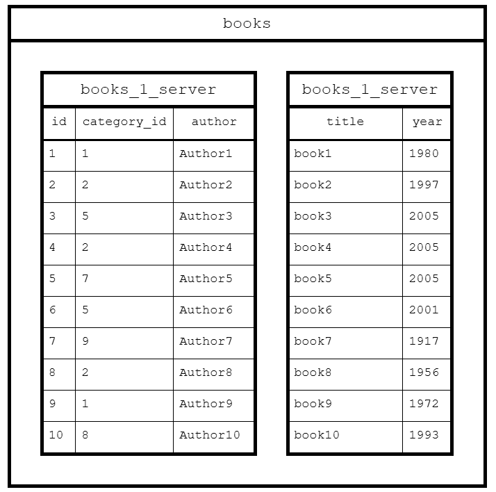
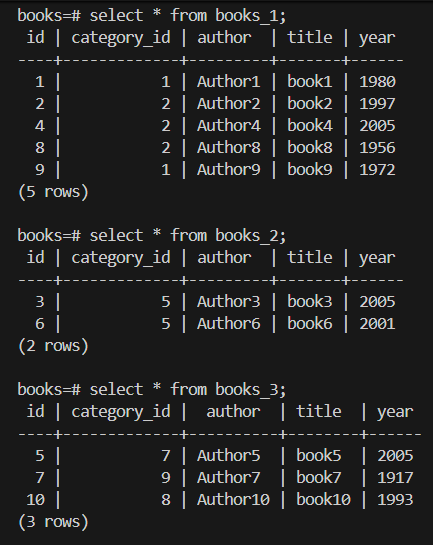
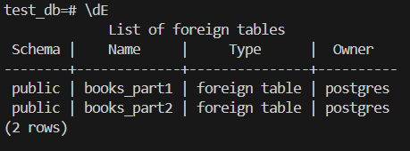

# Домашнее задание к занятию «Репликация и масштабирование. Часть 2»

### Задание 1

Опишите основные преимущества использования масштабирования методами:

- активный master-сервер и пассивный репликационный slave-сервер; 
- master-сервер и несколько slave-серверов;


*Дайте ответ в свободной форме.*

### Решение 1

**Активный master-сервер и пассивный репликационный slave-сервер**

Главная особенность при способе масштабирования, где активный  master-сервер и пассивный репликационный slave-сервер в том, что slave-сервер не просто хранит копию данных, но и готов в любой момент заменить master.

Перераспределение нагрузки: slave-сервер может обрабатывать тяжелые аналитические запросы, а master-сервер — продолжать заниматься вставкой и обновлением данных.

При возникновении ошибки файловой системы на master-сервере, slave-сервер хранит копию и проверяет целостность приходящих WAL-логов, что служит дополнительным фильтром ошибок.

Можно разместить master-сервер в одном дата-центре, а slave-сервер — в другом. Продолжение  работы на резервном сервере при отключении основного.


**master-сервер и несколько slave-серверов**

При выходе из строя одного slave-сервера, другие всё ещё продолжают работать, что повышает отказоустойчивость.
Повышенная производительность.

настроить реплики по-разному в зависимости от задач:

- Slave №1 (Синхронный): Стоит в том же дата-центре. Master ждет подтверждения записи от него. Это гарантирует 0% потери данных.
- Slave №2 (Асинхронный): Стоит в другом городе. Master не ждет его, чтобы не тормозить работу. Это защита на случай катастрофы (пожар в основном ДЦ).
- Slave №3 (С задержкой / Delayed): Специально настроен так, чтобы повторять действия Master с опозданием в 1 час. Если программист случайно удалит таблицу на Master, будет час, чтобы забрать её со Slave №3, пока команда DROP TABLE туда не долетела.

---

### Задание 2

Разработайте план для выполнения горизонтального и вертикального шаринга базы данных. База данных состоит из трёх таблиц: 

- пользователи, 
- книги, 
- магазины (столбцы произвольно). 

Опишите принципы построения системы и их разграничение или разбивку между базами данных.

*Пришлите блоксхему, где и что будет располагаться. Опишите, в каких режимах будут работать сервера.* 

### Решение 2

**Не будем забывать:**

- **Партиционирование** — способ организации данных на одном сервере(хосте).
- **Шардирование** — способ масштабирования при котором данные распределяются по разным серверам(хостам).
  - **Горизонтальное** — разделение таблицы по строкам.
  - **Вертикальное** — разделение по столбцам или функциональным блокам.


Схема горизонтального шардирования взятая из лекции:

В данном примере происходит разделение строк по разным серверам.



Схема вертикального шардирования:

В данном примере происходит разделение БД по таблицам



Или же можно шардировать таблицу books по колонкам:



---

### Задание 3*

Выполните настройку выбранных методов шардинга из задания 2.

*Пришлите конфиг Docker и SQL скрипт с командами для базы данных*.

### Решение 3

- Горизонтальное шардирование (взят пример из лекции)

Структура проекта:
...\
├── conf\
│&nbsp;&nbsp;&nbsp;&nbsp;&nbsp;&nbsp;├── postgres_b\
│&nbsp;&nbsp;&nbsp;&nbsp;&nbsp;&nbsp;│&nbsp;&nbsp;&nbsp;&nbsp;&nbsp;&nbsp;└── [shards.sql](file/task3_v1/conf/postgres_b/start.sql)\
│&nbsp;&nbsp;&nbsp;&nbsp;&nbsp;&nbsp;├── postgres_b1\
│&nbsp;&nbsp;&nbsp;&nbsp;&nbsp;&nbsp;│&nbsp;&nbsp;&nbsp;&nbsp;&nbsp;&nbsp;└── [shards.sql](file/task3_v1/conf/postgres_b1/start.sql)\
│&nbsp;&nbsp;&nbsp;&nbsp;&nbsp;&nbsp;├── postgres_b2\
│&nbsp;&nbsp;&nbsp;&nbsp;&nbsp;&nbsp;│&nbsp;&nbsp;&nbsp;&nbsp;&nbsp;&nbsp;└── [shards.sql](file/task3_v1/conf/postgres_b2/start.sql)\
│&nbsp;&nbsp;&nbsp;&nbsp;&nbsp;&nbsp;└── postgres_b3\
│&nbsp;&nbsp;&nbsp;&nbsp;&nbsp;&nbsp;&nbsp;&nbsp;&nbsp;&nbsp;&nbsp;&nbsp;&nbsp;&nbsp;└── [shards.sql](file/task3_v1/conf/postgres_b3/start.sql)\
└── [docker-compose.yml](file/task3_v1/conf/docker-compose.yml)

Заполнение базы данных

```sql
INSERT INTO books (id, category_id, author, title, year)
VALUES (1, 1, 'Author1', 'book1',1980),
(2, 2, 'Author2', 'book2', 1997),
(3, 5, 'Author3', 'book3', 2005),
(4, 2, 'Author4', 'book4', 2005),
(5, 7, 'Author5', 'book5', 2005),
(6, 5, 'Author6', 'book6', 2001),
(7, 9, 'Author7', 'book7', 1917),
(8, 2, 'Author8', 'book8', 1956),
(9, 1, 'Author9', 'book9', 1972),
(10, 8, 'Author10', 'book10', 1993);
```


Выполнение команд на мастере:

```
docker exec -it postgres_b psql -U postgres -d books
```

`postgres` - пользователь

`books` - база данных

```sql
select * from books_1;
select * from books_2;
select * from books_3;
```



- Вертикальное шардирование

Структура проекта:

...\
├── conf\
│&nbsp;&nbsp;&nbsp;&nbsp;&nbsp;&nbsp;└── postgres_b\
│&nbsp;&nbsp;&nbsp;&nbsp;&nbsp;&nbsp;&nbsp;&nbsp;&nbsp;&nbsp;&nbsp;&nbsp;&nbsp;&nbsp;└── [shards.sql](file/task3_v2/conf/postgres_b/shards.sql)\
└── [docker-compose.yml](file/task3_v2/docker-compose.yml)



Согласно схеме:

